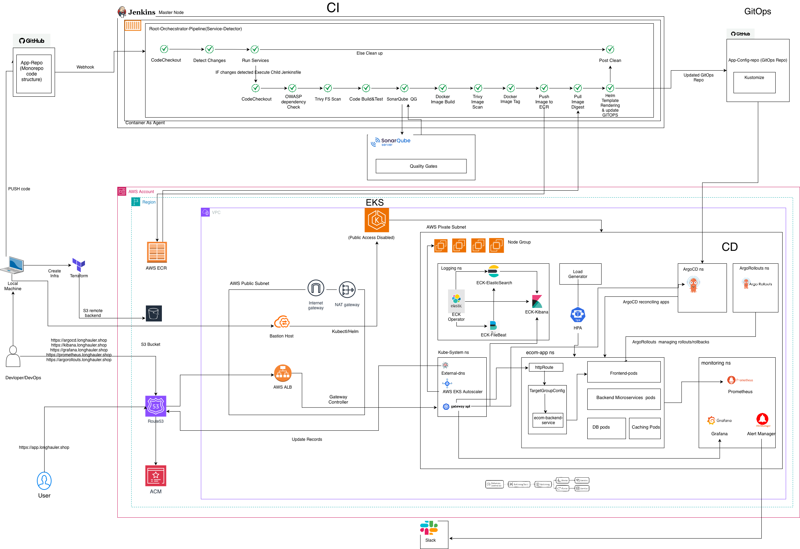

# Production Grade Cloud Native Microservices Platform

## Project Introduction

This project demonstrates how to build a production-grade cloud native microservices platform on AWS using Kubernetes, Terraform, GitOps, DevSecOps, and modern CI/CD practices.

The application used in this project is Google's Online Boutique, which consists of multiple independently deployable microservices.

## Why Online Boutique?

This project uses **Online Boutique**, an open-source microservices application developed by Google Cloud.

The application is a web-based e-commerce app where users can browse items, add them to the cart, and purchase them.

Online Boutique was chosen because it closely resembles a real-world e-commerce platform while remaining lightweight and easy to deploy on Kubernetes. It provides an excellent foundation for implementing production-grade infrastructure, GitOps workflows, security, observability, and progressive delivery strategies.

### Why Online Boutique?

- ✅ Official cloud-native microservices reference application developed by Google Cloud
- ✅ Consists of **11 independently deployable microservices**
- ✅ Built using multiple programming languages (Go, C#, Node.js, Python, Java)
- ✅ Uses **gRPC** for efficient inter-service communication
- ✅ Demonstrates real-world distributed system architecture
- ✅ Runs on any CNCF-compliant Kubernetes cluster, including Amazon EKS
- ✅ Ideal for implementing production-grade DevOps, GitOps, and Kubernetes best practices

This project extends the original Online Boutique application by building a complete production-ready platform around it using Infrastructure as Code, CI/CD, GitOps, security scanning, monitoring, logging, and automated deployments.

# 🏗️ Application Architecture

The Online Boutique application is composed of **11 independently deployable microservices** that communicate primarily using **gRPC**.
- The **Frontend** service is the main entry point of the application. Whenever a user opens the website, all requests first reach the Frontend service. It displays the web pages and communicates with other microservices to fetch the required information.
- For example, it gets product details from the **Product Catalog Service**, stores the user's shopping cart using the **Cart Service**, displays product recommendations from the **Recommendation Service**, and shows advertisements using the **Ad Service**.
- When the user places an order, the **Checkout Service** takes over the checkout process. It collects the items from the cart, calculates shipping charges, converts prices into the selected currency, processes the payment, arranges shipping, and finally asks the **Email Service** to send the order confirmation email.
- Each microservice performs only one specific task. This makes the application easier to maintain, scale, and update because changes made to one service do not affect the others.
- The **Cart Service** stores shopping cart data in **Redis**, while the **Load Generator** continuously sends requests to the application to simulate users and test how the application  behaves under traffic.


# 🎯 Project Goals

The primary objective of this project is to demonstrate how a real-world microservices application can be deployed and managed using production-grade cloud-native technologies and DevOps best practices.

This project focuses on achieving the following goals:

- Deploy a production-grade microservices application on Amazon EKS
- Automate infrastructure provisioning using Terraform
- Implement CI using Jenkins distributed architecture
- Implement GitOps-based deployments using Argo CD
- Enable zero-downtime deployments using Argo Rollouts
- Build a secure CI/CD pipeline with automated quality and security checks
- Perform vulnerability scanning using Trivy and OWASP Dependency Check
- Integrate code quality analysis with SonarQube
- Implement centralized monitoring, logging, and observability
- Support scalable and highly available Kubernetes workloads


# ☁️ Cloud Native Architecture

This project follows Cloud Native principles to build a scalable, resilient, and production-ready platform on Kubernetes.

The cloud-native platform is built around the following core capabilities:

- Containerized application using Docker
- Kubernetes orchestration with Amazon EKS
- Service Discovery for inter-service communication
- Horizontal Pod Auto Scaling
- EKS Cluster Autoscaler
- Infrastructure as Code using Terraform
- GitOps-based continuous deployment using Argo CD
- Progressive delivery with Argo Rollouts
- Centralized Monitoring and Observability
- Immutable Infrastructure and declarative deployments


# Project Architecture



# 🔄 End-to-End Request Flow


```text
                           User Traffic
                                │
                                ▼
               AWS Application Load Balancer (ALB)
                                │
                                ▼
                     Gateway API (Gateway)
                                │
                                ▼
                          HTTPRoute
                                │
                                ▼
                     Argo Rollouts
                                │
                  ┌─────────────┴─────────────┐
                  │                           │
                  ▼                           ▼
      Stable Target Group (90%)    Canary Target Group (10%)
                  │                           │
                  ▼                           ▼
      Frontend Stable Service     Frontend Canary Service
                  │                           │
                  ▼                           ▼
          Stable ReplicaSet         Canary ReplicaSet
                  │                           │
                  ▼                           ▼
             Stable Pods               Canary Pods
```


# 🚀 Production-Grade Features

This project demonstrates the implementation of a production-ready cloud native platform using modern DevOps and GitOps practices.

## Infrastructure

- Amazon EKS
- Terraform
- AWS Load Balancer Controller
- IAM Roles for Service Accounts (IRSA)

## CI/CD & GitOps

- GitHub Actions
- Argo CD
- Argo Rollouts
- Helm
- Kustomize

## Security

- Trivy
- SonarQube
- OWASP Dependency Check

## Observability

- Prometheus
- Grafana
- ECK Operator
- ECK-FileBeat
- ECK-ElasticSearch
- ECK-Kibana

## Scaling 

- Horizontal Pod Autoscaler
- Cluster Autoscaler


The application consists of **11 independently deployable microservices** that communicate primarily using **gRPC**. Each service is responsible for a specific business capability, making the application modular, scalable, and fault tolerant.

### Core Microservices

- Frontend
- Product Catalog
- Cart
- Checkout
- Currency
- Payment
- Shipping
- Email
- Recommendation
- Ad Service
- Load Generator

