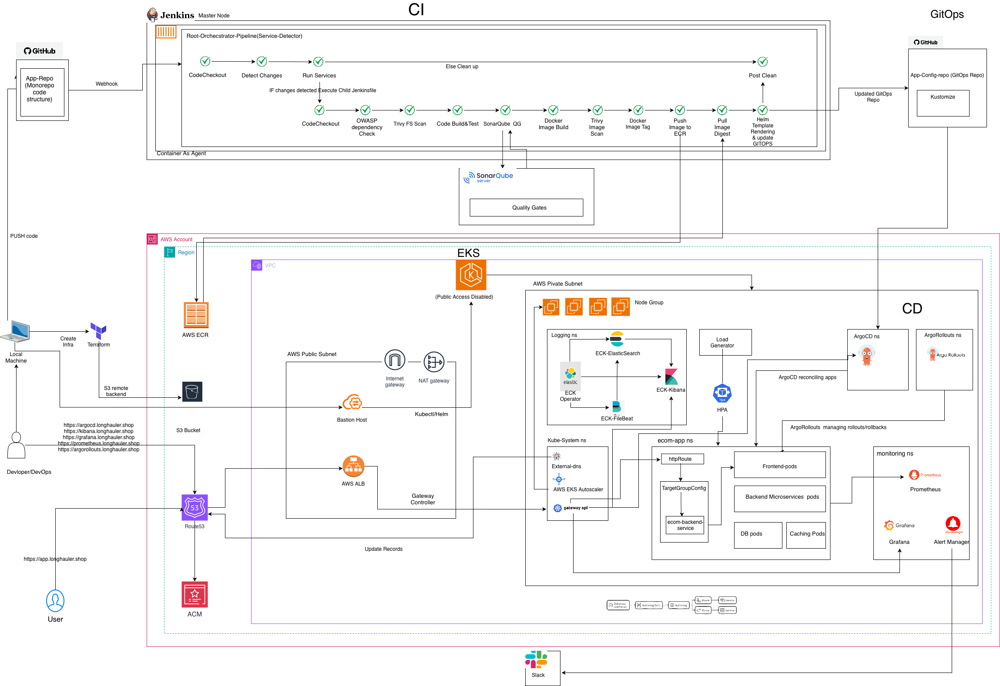

# Production Grade Cloud Native Microservices Platform

## Project Introduction

This project demonstrates how to build a production-grade cloud native microservices platform on AWS using Kubernetes, Terraform, GitOps, DevSecOps, and modern CI/CD practices.

The application used in this project is Google's Online Boutique, which consists of multiple independently deployable microservices.

## Microservices Application

The application is a web-based e-commerce app where users can browse items, add them to the cart, and purchase them.

Online Boutique was chosen because it closely resembles a real-world e-commerce platform while remaining lightweight and easy to deploy on Kubernetes.

### Why Online Boutique?

- ✅ Official cloud-native microservices reference application developed by Google Cloud
- ✅ Consists of **11 independently deployable microservices**
- ✅ Built using multiple programming languages (Go, C#, Node.js, Python, Java)
- ✅ Uses **gRPC** for efficient inter-service communication
- ✅ Demonstrates real-world distributed system architecture
- ✅ Runs on any CNCF-compliant Kubernetes cluster, including Amazon EKS
- ✅ Ideal for implementing production-grade DevOps, GitOps, and Kubernetes best practices

### Why Microservices Instead of a Monolithic Application?

A monolithic application contains all features in a single codebase and is deployed as one unit. Even a small change usually requires rebuilding and redeploying the entire application.

In contrast, Online Boutique follows a microservices architecture where each business function (cart, payment, product catalog, recommendation, checkout, etc.) runs as an independent service. This allows teams to develop, deploy, scale, and update services independently, making the application easier to maintain and scale.

### Stateless vs Stateful Services

Most services in Online Boutique are **stateless**, meaning they do not store user data locally. Any replica of a service can handle incoming requests, making horizontal scaling simple.

Some components are **stateful** because they store persistent data. For example, the shopping cart data is stored in Redis, allowing application Pods to restart or scale without losing user data.

# 🏗️ Application Architecture

The Online Boutique application is composed of **11 independently deployable microservices** that communicate primarily using **gRPC**.
- The **Frontend** service is the main entry point of the application. Whenever a user opens the website, all requests first reach the Frontend service. It displays the web pages and communicates with other microservices to fetch the required information.
- For example, it gets product details from the **Product Catalog Service**, stores the user's shopping cart using the **Cart Service**, displays product recommendations from the **Recommendation Service**, and shows advertisements using the **Ad Service**.
- When the user places an order, the **Checkout Service** takes over the checkout process. It collects the items from the cart, calculates shipping charges, converts prices into the selected currency, processes the payment, arranges shipping, and finally asks the **Email Service** to send the order confirmation email.
- Each microservice performs only one specific task. This makes the application easier to maintain, scale, and update because changes made to one service do not affect the others.
- The **Cart Service** stores shopping cart data in **Redis**, while the **Load Generator** continuously sends requests to the application to simulate users and test how the application  behaves under traffic.


# 🎯 Project Goals

The primary objective of this project is to demonstrate how a real-world microservices application can be deployed and managed using production-grade cloud-native technologies and DevOps best practices.

This project focuses on achieving the following goals:

- Deploy a production-grade microservices application on Amazon EKS
- Automate infrastructure provisioning using Terraform
- Implement CI using Jenkins distributed architecture
- Implement GitOps-based deployments using Argo CD
- Enable zero-downtime deployments using Argo Rollouts
- Build a secure CI/CD pipeline with automated quality and security checks
- Perform vulnerability scanning using Trivy and OWASP Dependency Check
- Integrate code quality analysis with SonarQube
- Implement centralized monitoring, logging, and observability
- Support scalable and highly available Kubernetes workloads


# ☁️ Cloud Native Architecture

This project follows Cloud Native principles to build a scalable, resilient, and production-ready platform on Kubernetes.

The cloud-native platform is built around the following core capabilities:

- Containerized application using Docker
- Kubernetes orchestration with Amazon EKS
- Service Discovery for inter-service communication
- Horizontal Pod Auto Scaling
- EKS Cluster Autoscaler
- Infrastructure as Code using Terraform
- GitOps-based continuous deployment using Argo CD
- Progressive delivery with Argo Rollouts
- Centralized Monitoring and Observability
- Immutable Infrastructure and declarative deployments


# Project Architecture



# 🔄 End-to-End Request Flow


```text
                           User Traffic
                                │
                                ▼
               AWS Application Load Balancer (ALB)
                                │
                                ▼
                     Gateway API (Gateway)
                                │
                                ▼
                          HTTPRoute
                                │
                                ▼
                     Argo Rollouts
                                │
                  ┌─────────────┴─────────────┐
                  │                           │
                  ▼                           ▼
      Stable Target Group (90%)    Canary Target Group (10%)
                  │                           │
                  ▼                           ▼
      Frontend Stable Service     Frontend Canary Service
                  │                           │
                  ▼                           ▼
          Stable ReplicaSet         Canary ReplicaSet
                  │                           │
                  ▼                           ▼
             Stable Pods               Canary Pods
```


# 🚀 Production-Grade Features

## Infrastructure

- Amazon EKS
- AWS VPC
- Terraform
- AWS Load Balancer Controller
- AWS Auto Scaling Groups
- AWS Route 53
- IAM Roles for Service Accounts (IRSA)

## CI/CD & GitOps

- GitHub Actions
- Jenkins
- Argo CD
- Argo Rollouts
- Helm
- Kustomize

## Security

- NAT Gateway
- AWS Secrets Manager
- Trivy
- SonarQube
- OWASP Dependency Check

## Observability

- Prometheus
- Grafana
- ECK Operator
- ECK-FileBeat
- ECK-ElasticSearch
- ECK-Kibana

## Scaling 

- Horizontal Pod Autoscaler
- Cluster Autoscaler

# Infrastructure Setup

## Environment

All infrastructure components are installed and managed from a Bastion Host.

### Bastion Host

The Bastion Host acts as the administration machine for the Kubernetes cluster. It has all the required CLI tools installed, including:

- AWS CLI
- kubectl
- eksctl
- Helm
- Terraform
- Git
- Docker (optional)

From this machine, all Kubernetes and AWS administrative operations are performed.

---

## Verify Connectivity

Before starting the installation, verify that the Bastion Host can communicate with the EKS cluster.

### Verify AWS Identity

```bash
aws sts get-caller-identity
```

### Verify Kubernetes Cluster Access

```bash
kubectl get nodes
```

Expected Output

```text
NAME                             STATUS   ROLES    AGE   VERSION
ip-192-168-27-57.ec2.internal    Ready    <none>   38m   v1.35.6-eks-bca9cf6
ip-192-168-56-167.ec2.internal   Ready    <none>   38m   v1.35.6-eks-bca9cf6
ip-192-168-9-145.ec2.internal    Ready    <none>   38m   v1.35.6-eks-bca9cf6
ip-192-168-95-231.ec2.internal   Ready    <none>   38m   v1.35.6-eks-bca9cf6
```

---

# Infrastructure Layer

This section covers all the infrastructure components used in the Amazon EKS cluster.

---

## AWS Load Balancer Controller

The AWS Load Balancer Controller provisions and manages AWS Application Load Balancers (ALB) and Network Load Balancers (NLB) directly from Kubernetes resources such as **Ingress**, **Service**, and **Gateway API** resources.

---

### Official Documentation

- https://docs.aws.amazon.com/eks/latest/userguide/lbc-helm.html
- https://kubernetes-sigs.github.io/aws-load-balancer-controller/latest/deploy/installation/

---

### Prerequisites

Before installing the AWS Load Balancer Controller, ensure the following prerequisites are met.

- Amazon EKS Cluster
- kubectl configured
- Helm installed
- IAM OIDC Provider
- IAM Roles for Service Accounts (IRSA)
- Gateway API CRDs (Required if using Gateway API)

---

### Installation

#### Step 1 - Create IAM OIDC Provider

This step enables IAM Roles for Service Accounts (IRSA), allowing Kubernetes service accounts to securely assume AWS IAM roles without storing AWS credentials inside pods.

> **Note**
>
> Skip this step if the OIDC provider is already created. In this project, the OIDC provider is provisioned through Terraform.

```bash
eksctl utils associate-iam-oidc-provider \
    --region <region-code> \
    --cluster <cluster-name> \
    --approve
```

Verify

```bash
aws eks describe-cluster \
--name <cluster-name> \
--query cluster.identity.oidc.issuer
```

---

#### Step 2 - Create IAM Policy

Download the IAM policy required by the AWS Load Balancer Controller.

```bash
curl -O https://raw.githubusercontent.com/kubernetes-sigs/aws-load-balancer-controller/v2.14.1/docs/install/iam_policy.json
```

Create the IAM policy.

```bash
aws iam create-policy \
    --policy-name AWSLoadBalancerControllerIAMPolicy \
    --policy-document file://iam_policy.json
```

Expected Output

```text
arn:aws:iam::<AWS_ACCOUNT_ID>:policy/AWSLoadBalancerControllerIAMPolicy
```

---

#### Step 3 - Create IAM Service Account (IRSA)

```bash
eksctl create iamserviceaccount \
    --cluster=<cluster-name> \
    --namespace=kube-system \
    --name=aws-load-balancer-controller \
    --attach-policy-arn=arn:aws:iam::<AWS_ACCOUNT_ID>:policy/AWSLoadBalancerControllerIAMPolicy \
    --override-existing-serviceaccounts \
    --region <region-code> \
    --approve
```

Verify

```bash
kubectl get serviceaccount aws-load-balancer-controller -n kube-system

NAME                           AGE
aws-load-balancer-controller   49s
```

---

#### Step 4 - Add Helm Repository

```bash
helm repo add eks https://aws.github.io/eks-charts

helm repo update
```

Verify

```bash
helm repo list
NAME                    URL                                                
argo                    https://argoproj.github.io/argo-helm    
```

---

#### Step 5 - Install AWS Load Balancer Controller

```bash
helm upgrade -i aws-load-balancer-controller \
eks/aws-load-balancer-controller \
-n kube-system \
--set clusterName=<cluster-name> \
--set region=<aws-region> \
--set vpcId=vpc-070a82c6c0e55fd5d \
--set serviceAccount.create=false \
--set serviceAccount.name=aws-load-balancer-controller \
--set controllerConfig.featureGates.NLBGatewayAPI=true \
--set controllerConfig.featureGates.ALBGatewayAPI=true \
--version 3.0.0
```

### Verify Installation

```bash
kubectl get deployment -n kube-system aws-load-balancer-controller
NAME                           READY   UP-TO-DATE   AVAILABLE   AGE
aws-load-balancer-controller   2/2     2            2           2m47s

```

## Gateway API

Gateway API is the next-generation networking API for Kubernetes that controls how external traffic reaches applications running inside the cluster. It is the successor to the traditional **Ingress** resource and provides a more flexible and standardized way to configure traffic routing using resources such as **GatewayClass**, **Gateway**, and **HTTPRoute**. :contentReference[oaicite:2]{index=2}

In this project, Gateway API is used together with the **AWS Load Balancer Controller** to provision and manage AWS Application Load Balancers (ALB) and Network Load Balancers (NLB). Gateway API also enables advanced traffic management features such as canary deployments with Argo Rollouts.

---

### Official Documentation

- https://kubernetes-sigs.github.io/aws-load-balancer-controller/latest/guide/gateway/l7gateway/

---

## Installation

### Step 1 - Install Standard Gateway API CRDs (Required)

Install the standard Gateway API Custom Resource Definitions (CRDs). These resources are required for Gateway API functionality.

```bash
kubectl apply -f https://github.com/kubernetes-sigs/gateway-api/releases/download/v1.3.0/standard-install.yaml
```

The following core Gateway API resources are installed:

- GatewayClass
- Gateway
- HTTPRoute
- ReferenceGrant

---

### Step 2 - Install Experimental Gateway API CRDs (Optional)

Install the experimental Gateway API CRDs if your environment requires additional Layer 4 routing resources such as **TCPRoute**, **UDPRoute**, **TLSRoute**, or **GRPCRoute**.

> **Note**
>
> This step is optional and is only required when using experimental Gateway API features.

```bash
kubectl apply -f https://github.com/kubernetes-sigs/gateway-api/releases/download/v1.3.0/experimental-install.yaml
```

Additional resources installed include:

- TCPRoute
- UDPRoute
- TLSRoute
- GRPCRoute

---

### Step 3 - Install AWS Load Balancer Controller Gateway API CRDs

Install the AWS Load Balancer Controller specific Gateway API CRDs. These CRDs enable the controller to provision and manage AWS Application Load Balancers (ALB) and Network Load Balancers (NLB) from Gateway API resources.

```bash
kubectl apply -f https://raw.githubusercontent.com/kubernetes-sigs/aws-load-balancer-controller/refs/heads/main/config/crd/gateway/gateway-crds.yaml
```

---

## Verify Installation

Verify that the Gateway API CRDs have been installed successfully.

```bash
kubectl get crds | grep gateway
```

Expected Output

```text
gatewayclasses.gateway.networking.k8s.io
gateways.gateway.networking.k8s.io
httproutes.gateway.networking.k8s.io
referencegrants.gateway.networking.k8s.io
```
---

## Create GatewayClass

A **GatewayClass** defines which controller is responsible for managing Gateway resources. Since this project uses the **AWS Load Balancer Controller**, the `controllerName` is set to `gateway.k8s.aws/alb`. Any Gateway referencing this GatewayClass will be managed by the AWS Load Balancer Controller.

Create the GatewayClass manifest.

**gateway-class.yaml**

```yaml
apiVersion: gateway.networking.k8s.io/v1beta1
kind: GatewayClass
metadata:
  name: aws-alb-gateway-class
spec:
  controllerName: gateway.k8s.aws/alb
```

Apply the manifest.

```bash
kubectl apply -f gateway-class.yaml
```

Verify

```bash
kubectl get gatewayclass

NAME                    CONTROLLER            ACCEPTED   AGE
aws-alb-gateway-class   gateway.k8s.aws/alb   True       7s
```

---

## Create LoadBalancerConfiguration

The **LoadBalancerConfiguration** resource is specific to the **AWS Load Balancer Controller**. It allows you to customize how the AWS Application Load Balancer (ALB) is created, including the scheme, listeners, certificates, security groups, and other load balancer settings. This resource is **not required** by all Gateway API controllers.

Create the LoadBalancerConfiguration manifest.

**alb-config.yaml**

```yaml
apiVersion: gateway.k8s.aws/v1beta1
kind: LoadBalancerConfiguration
metadata:
  name: app-gw-lbconfig
  namespace: default
spec:
  scheme: internet-facing
  listenerConfigurations:
    - protocolPort: HTTPS:443
      defaultCertificate: <certificate-arn>
```

Apply the manifest.

```bash
kubectl apply -f alb-config.yaml
```

Verify

```bash
kubectl get loadbalancerconfigurations -n default
```

---

## Create Gateway

A **Gateway** acts as the entry point for external traffic into the Kubernetes cluster. It references the previously created **GatewayClass** and **LoadBalancerConfiguration**, allowing the AWS Load Balancer Controller to provision an AWS Application Load Balancer (ALB).

Create the Gateway manifest.

**gateway.yaml**

```yaml
apiVersion: gateway.networking.k8s.io/v1beta1
kind: Gateway
metadata:
  name: app-alb-gateway
  namespace: default
spec:
  gatewayClassName: aws-alb-gateway-class
  infrastructure:
    parametersRef:
      kind: LoadBalancerConfiguration
      name: app-gw-lbconfig
      group: gateway.k8s.aws
  listeners:
    - name: http
      protocol: HTTP
      port: 80
      #hostname: ""     #this would be provided inside the httproute object corresponding to the application.
      allowedRoutes:
        namespaces:
          from: All

    - name: https
      protocol: HTTPS
      port: 443
      #hostname: ""     #this would be provided inside the httproute object corresponding to the application.
      allowedRoutes:
        namespaces:
          from: All
```

Apply the manifest.

```bash
kubectl apply -f gateway.yaml
```

---

## Verify Gateway

Verify that the Gateway resource has been created successfully.

```bash
kubectl get gateway -A
```

Expected Output

```text
NAME              CLASS                   ADDRESS                                                                  PROGRAMMED   AGE
app-alb-gateway   aws-alb-gateway-class   k8s-default-appalbga-65aa25bc91-1838810992.us-east-1.elb.amazonaws.com   Unknown      5s
```

You can also verify that an **Application Load Balancer (ALB)** has been created in the **AWS Management Console** under **EC2 → Load Balancers**. Once the controller finishes reconciliation, the `PROGRAMMED` status changes to `True`, indicating that the Gateway has been successfully provisioned.


